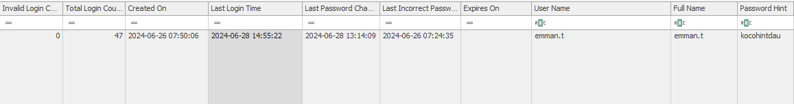

## Sherlock Scenario

Our customer discovered illegal RDP sessions without Privileged Access Management (PAM) in their system on June 28. They collected evidence on a server they suspected was an intermediary server to move laterally to others. Even though the attacker deleted the event log, I believe the few remaining artifacts are enough to help confirm the attack flow and trace the attacker's behavior.

### Required Tools

- [EZ Tools](https://ericzimmerman.github.io/#!index.md) 
- [Event log explorer](https://eventlogxp.com/)
- [FTK Imager](https://www.exterro.com/ftk-product-downloads/ftk-imager-version-4-7-1)
- [DataProtectionDecryptor](https://www.nirsoft.net/utils/dpapi_data_decryptor.html)
- [BMC-Tools](https://github.com/ANSSI-FR/bmc-tools)

#### Task 01

**When was the last failed logon attempt using emman.t user? (UTC)**

According to this scenario, the attacker event logs have been cleared, so this cannot be checked from the windows event log.

For this you have to dive through registry keys. to check the SAM registry keys for the time of the last authentication failure.

The SAM database is stored in the following registry path:

```
HKEY_LOCAL_MACHINE\SAM\SAM\Domains\Account\Users
```

**Identify User Entries**:
- Each user account is identified by a Relative Identifier (RID). These can be found under the `Users` subkey.


In Windows, each security principal (such as a user, group, or computer account) is assigned a unique identifier known as a **Security Identifier (SID)**. The **Relative Identifier (RID)** is the last part of the SID and is used to distinguish individual accounts within a domain or system.

**SID Format:**

A typical SID follows this format:

```
S-1-5-21-<domain_identifier>-<machine_identifier>-<RID>
```

In the above image, the folders under the `Users` registry key appear to be in hexadecimal format, representing the Relative Identifiers (RIDs) for various accounts on the system.

**For example:**

- `000001F4` is the hexadecimal representation of RID `500`, which is the built-in Administrator account.
- `000001F5` is RID `501`, corresponding to the built-in Guest account.
- `000003EA` is the hexadecimal representation of RID `1002`, which would be a user-created account since user RIDs typically start at `1000` (decimal or `3E8` in hexadecimal).

To convert hexadecimal RIDs to decimal:

- **1F4** (hex) = **500** (decimal)
- **1F5** (hex) = **501** (decimal)
- **1F7** (hex) = **503** (decimal)
- **3EA** (hex) = **1002** (decimal)

**Locate Authentication Data**:
- Within each user's key, data related to authentication, including timestamps of failed login attempts, can be stored. Look for entries such as `LastFailedLogon` or analyze the data in the `V` value to extract the relevant information.



```
Username        : emman.t [1000]
SID             : S-1-5-21-1281496067-1440983016-2272511217-1000
Full Name       : emman.t
User Comment    : 
Account Type    : 
Account Created : Wed Jun 26 07:50:06 2024 Z
Name            :  
Password Hint   : kocohintdau
Last Login Date : Fri Jun 28 14:55:22 2024 Z
Pwd Reset Date  : Fri Jun 28 13:14:09 2024 Z
Pwd Fail Date   : Wed Jun 26 07:24:35 2024 Z
Login Count     : 47
  --> Normal user account
```


The **Security Account Manager (SAM) registry** is a component in Windows operating systems that stores user account information, such as usernames and password hashes. It is part of the Windows registry and is crucial for managing user authentication and security.

The SAM database contains:

1. **Local user accounts**: For local authentication to the Windows system.
2. **Password hashes**: Stored in a hashed and encrypted format for security purposes.
3. **Group memberships**: Local security groups and their memberships.

The SAM database is located in the registry at:

```
HKEY_LOCAL_MACHINE\SAM
```

This registry key is protected and cannot be accessed while the operating system is running, as it is locked to ensure security. It is a key target for attackers because gaining access to the SAM file and extracting password hashes can lead to privilege escalation attacks. Tools like `pwdump` or `mimikatz` are commonly used in these attacks, but proper security measures (e.g., using the Local Security Authority Subsystem Service or LSA) help to protect this database.

